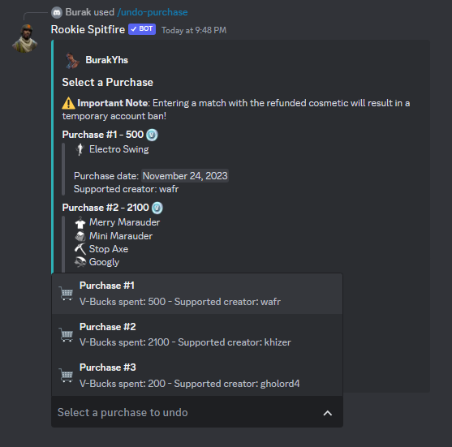
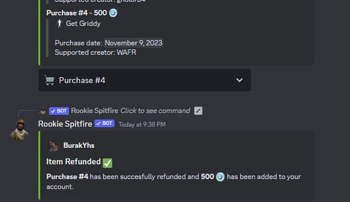
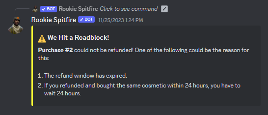

# 🆓 Free Refunds


Ban Warning: If you are in-game and enter a match with the refunded cosmetic, you will get banned temporarily from Fortnite! Please log in and out of the game after refunding!


## Step 1

Use the /undo-purchase command. Please note that the bot shows purchases made in the last 30 days, but you can't refund them all.

## Step 2

Select the purchase you want to refund.&#x20;

<figure><figcaption></figcaption></figure>

## After Refunding

After refunding, there are two possibilities:

### :white\_check\_mark: Success

You have successfully refunded your purchase for free, as I accidentally did here! \
If you haven't received your V-Bucks back, please exit the game and re-enter.

<figure><figcaption></figcaption></figure>

### :x: Error

If you received an error saying "This purchase couldn't refunded", this means that you can't refund the item for free.\
\
However, if you refunded the purchased item within 24 hours and bought it again, you can refund it after 24 hours.

<figure><figcaption></figcaption></figure>
