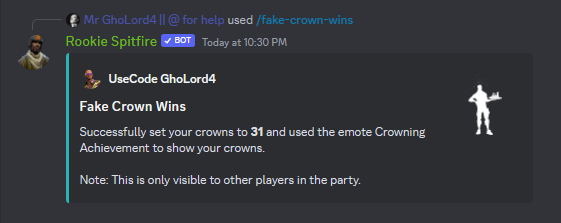

# 👻 Ghost Equip


Outfits, emotes etc. can only be seen by other players in your party.


## Ghost Equip

Very simple to use, use the /ghost-equip command and the other players in your party will see you as the cosmetic of your choice!

With Premium you can equip cosmetics with their own style!

<figure><figcaption></figcaption></figure>

## :star: Premium Feature: Fake Crown Wins

Just like the ghost-equip command, you can fake your crown wins too!

<figure><figcaption></figcaption></figure>

## :star: Premium Feature: Fake Level

<figure><figcaption></figcaption></figure>

Just like the ghost-equip command, again, you can fake your level.
