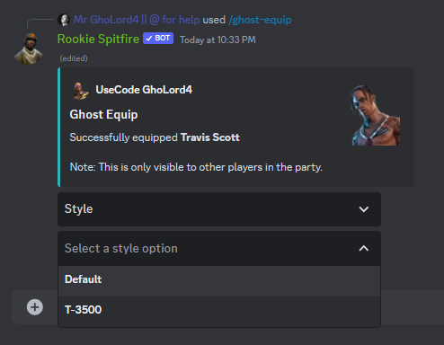
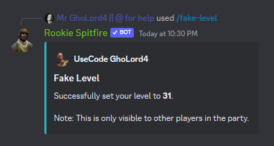

# 👻 Ghost Equip


Outfits, emotes etc. can only be seen by other players in your party.\
These features are special to [Premium](../premium-system.md) users.


## Ghost Equip

Very simple to use, use the /ghost-equip command and the other players in your party will see you as the cosmetic of your choice!

<figure><figcaption></figcaption></figure>

## Fake Crown Wins

Just like the ghost-equip command, you can fake your crown wins too!

<figure><figcaption></figcaption></figure>

## Fake Level

<figure><figcaption></figcaption></figure>

Just like the ghost-equip command, again, you can fake your level.
