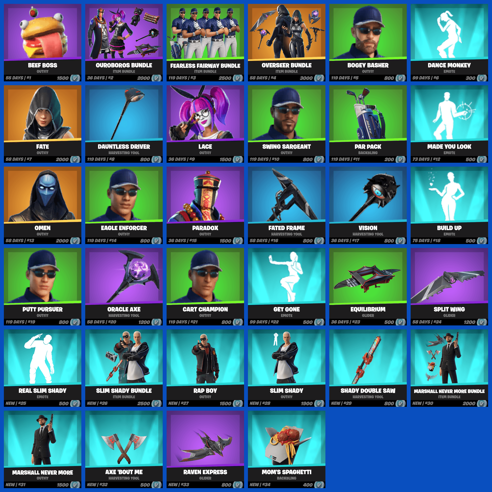
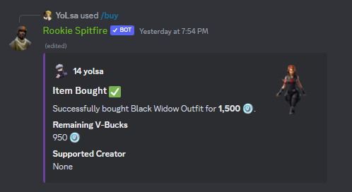
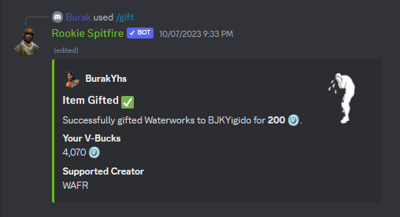

# 🛒 Item Shop

## :frame\_photo: Image Example

You can view the item shop by using the /shop command.

<figure><figcaption></figcaption></figure>

## :moneybag: Buy

You can buy items from the item shop using the /buy command.

<figure><figcaption></figcaption></figure>

## :gift: Gift

You can gift items from the item shop to your friends using the /gift command.

<figure><figcaption></figcaption></figure>


There is a confirmation message in both /buy and /gift commands

