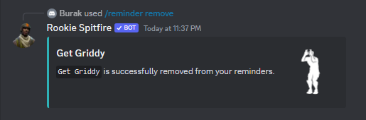

# 🗓 Reminders


You must join our support server or keep your DMs open to be notified


## Adding to Reminders

To add a cosmetic to your reminder list, use the /reminder add command.

<figure><figcaption></figcaption></figure>

## Remove from Reminders

To remove a cosmetic from reminder list, use the /reminder remove command.

<figure><figcaption></figcaption></figure>
