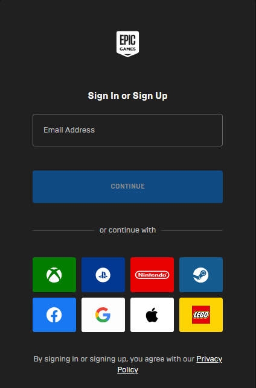
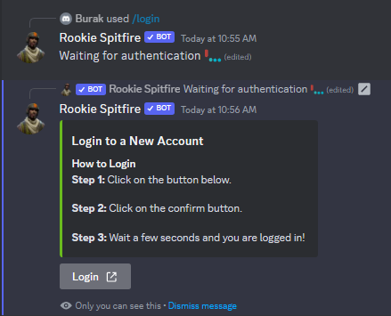
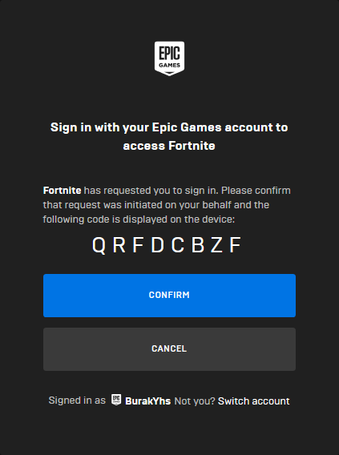
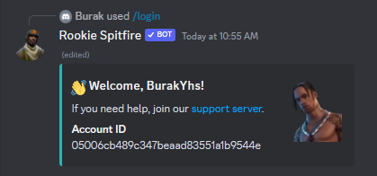

# 📥 Login

## Step 1

To login to the bot, you must first be logged in to your account on [epicgames.com](https://epicgames.com). \
If you are already logged in to [epicgames.com](https://epicgames.com), you can skip this step.

<figure><figcaption></figcaption></figure>

## Step 2

After logging into your account on the website, go back to Discord and use the `login` command. Then press the "Login" button.

<figure><figcaption></figcaption></figure>

## Step 3

Press the "Confirm" button on the page that opens and go back to Discord. You will be logged in to your Epic Games account 🥳

<figure><figcaption></figcaption></figure>

<figure><figcaption></figcaption></figure>


Use "/logout" command to log out of your account.

